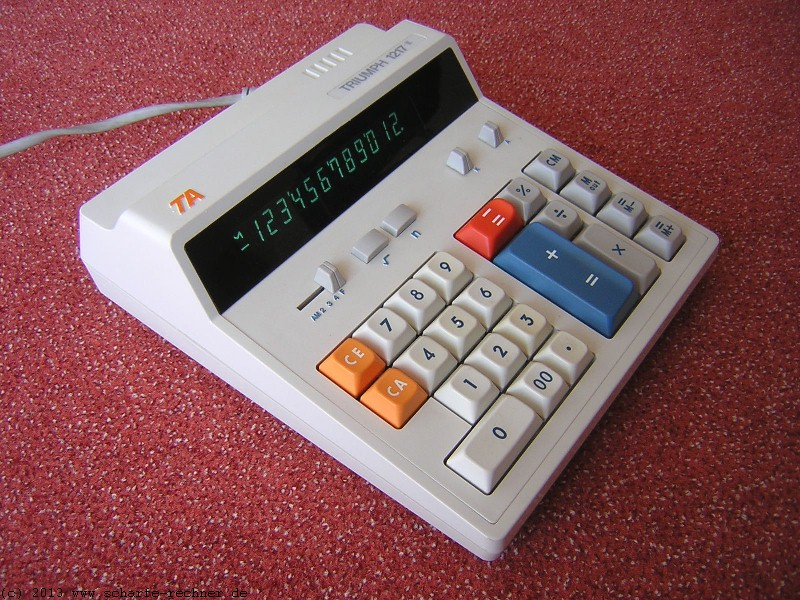

## JavaScript  Retro Calculator:

------

**Projeto para desenvolvimento e aplicação de conhecimentos em HTML, CSS e Javascript.*

*criado por:* ***Thiago de Oliveira Miranda***, *cursando o 2⁰ período de  Análise e Desenvolvimento de Sistemas pela faculdade Estácio de Sá.*

https://thiagoomiranda.github.io/vintage-calculator/

_________

#### Objetivos e Inspirações 

- Criar uma calculadora funcional com o design Retrô/Vintage inspirado na calculadora  **Adler / TRIUMPH 1217:**

​			Para isto o corpo da calculcadora foi modelado em 3D no Blender, utilizando como layout base a disposição dos botôes dos aps atuais de calculadoras para android. 

- Aplicar os conceitos de layout responsivo em HTML5 e CSS3.

  

  ------

  

  O código *javascript/JQuery* foi adaptado da versão desenvolvida por ***Justin Woodward***: [Javascript Calculator (codepen.io)](https://codepen.io/freeCodeCamp/full/rLJZrA).
  
  
  
  ________
  
  

